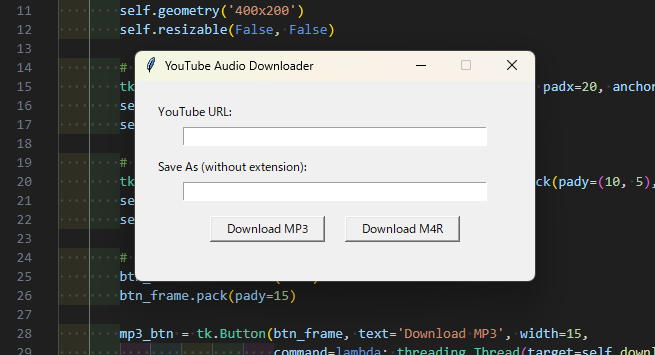

# util-py
日常生活で使う小さな Python コードの置き場

## Auto Click GUI(USSR) の使い方

環境構築等は不要、/auto/auto_click_gui 直下にある SovietAutoClicker.exe を実行してください。

## Get Youtube Audio GUI の使い方

YouTube 上から音源を取得する GUI

※ 事前に ffmpeg を導入してから GUI を起動してください。

### Usage
/youtube 直下にある get_youtube_audio_gui.exe を実行してください。

1. URL と保存名を入力します。
1. MP3 か M4R のダウンロードボタンを押せば完了です。
